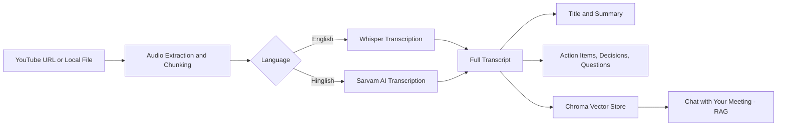

# AI Video Assistant
 
Turn any video or meeting recording into a searchable transcript, an AI-generated summary, and a chatbot you can ask questions to.
 
Give it a YouTube link or a local audio/video file. It transcribes the audio, generates a title, summary, action items, key decisions, and open questions — then lets you chat with the transcript afterward.
 
## Features
 
- 🎥 **Flexible input** — YouTube URL or local audio/video file
- 🌐 **Bilingual transcription** — [OpenAI Whisper](https://github.com/openai/whisper) for English, [Sarvam AI](https://www.sarvam.ai/) for Hindi-English (Hinglish)
- ✂️ **Handles long recordings** — audio is chunked automatically and summarized map-reduce style, so length isn't limited by model context
- 📝 **Structured output** — auto-generated title, summary, action items (with owner & deadline), key decisions, and open questions
- 💬 **Chat with your meeting** — a RAG pipeline (Chroma + HuggingFace embeddings + Mistral) lets you ask follow-up questions about anything discussed
## How it works
 

 
## Project structure
 
```
AI-Video-Assistant/
├── main.py                   # CLI entry point — runs the pipeline, then a chat loop
├── app.py                    # Planned Streamlit UI (not yet implemented)
├── requirements.txt
├── core/
│   ├── transcriber.py        # Whisper + Sarvam AI transcription
│   ├── Summarize.py          # Title generation + map-reduce summarization
│   ├── extractor.py          # Action items / decisions / open questions
│   ├── vector_store.py       # Chroma vector store + embeddings
│   └── rag_engine.py         # RAG chain for chatting with the transcript
└── utlis/
    └── audio_processor.py    # YouTube download, audio conversion, chunking
```
 
## Prerequisites
 
- Python 3.10+
- [ffmpeg](https://ffmpeg.org/download.html) installed and on your `PATH` (required by `pydub` and `yt-dlp`)
- A [Mistral AI](https://console.mistral.ai/) API key — used for summarization, extraction, and chat
- A [Sarvam AI](https://www.sarvam.ai/) API key — only needed for Hinglish transcription
## Installation
 
```bash
git clone https://github.com/AyushNeedsCaffeine/AI-Video-Assistant.git
cd AI-Video-Assistant
python -m venv venv
source venv/bin/activate        # Windows: venv\Scripts\activate
pip install -r requirements.txt
```
 
## Configuration
 
Copy `.env.example` to `.env` and fill in your keys:
 
```bash
cp .env.example .env
```
 
| Variable | Required | Default | Description |
|---|---|---|---|
| `MISTRAL_API_KEY` | Yes | — | Summaries, extraction, and RAG chat |
| `SARVAM_API_KEY` | Only for Hinglish | — | Hinglish transcription |
| `WHISPER_MODEL` | No | `small` | Any [Whisper model size](https://github.com/openai/whisper#available-models-and-languages) (`tiny`/`base`/`small`/`medium`/`large`) |
| `SARVAM_STT_MODEL` | No | `saaras:v2.5` | Sarvam speech-to-text model |
 
## Usage
 
```bash
python main.py
```
 
You'll be prompted for:
1. A YouTube URL or a path to a local audio/video file
2. A language — `english` or `hinglish`
Once processing finishes, you'll see the title, summary, action items, key decisions, and open questions — then you can chat with the transcript directly in the terminal (type `exit` to quit).
 
## Tech stack
 
- **Transcription:** [OpenAI Whisper](https://github.com/openai/whisper), [Sarvam AI](https://www.sarvam.ai/)
- **LLM orchestration:** [LangChain](https://www.langchain.com/), [Mistral AI](https://mistral.ai/)
- **Vector search:** [Chroma](https://www.trychroma.com/), HuggingFace `sentence-transformers` (`all-MiniLM-L6-v2`)
- **Audio/video handling:** `yt-dlp`, `pydub`, `ffmpeg`
- **Planned UI:** [Streamlit](https://streamlit.io/)
## Roadmap / known issues
 
This project is under active development:
 
- [ ] `requirements.txt` is missing `langchain-chroma`, needed by the vector store — install manually for now: `pip install langchain-chroma`
- [ ] The RAG chat step has a couple of open bugs to fix before it runs end-to-end
- [ ] `app.py` (Streamlit UI) hasn't been built yet — the CLI in `main.py` is the only interface for now
## License
 
No license file is included yet. Until one is added, all rights are reserved by default — add a `LICENSE` file (e.g. MIT, Apache-2.0) if you'd like others to use or contribute to this project.
 